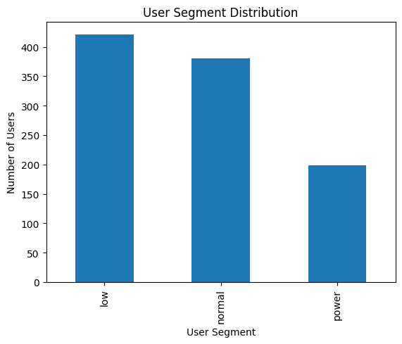
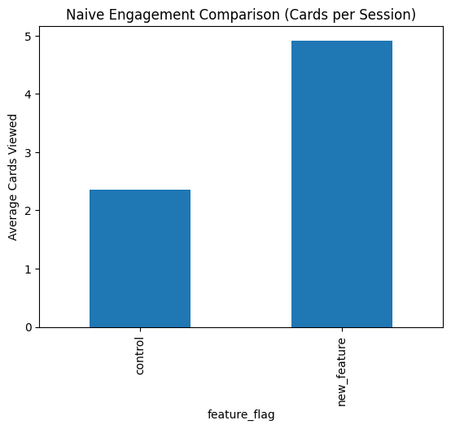
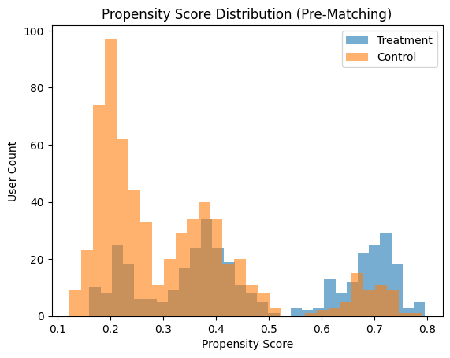
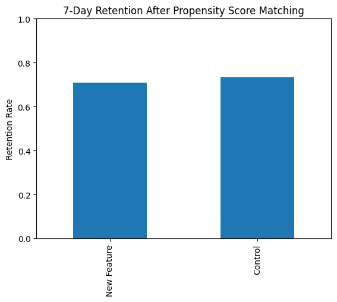
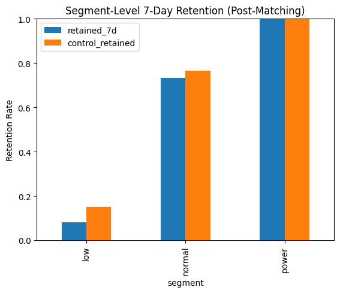

# Feature Impact Analysis  
**Identifying the True Impact of a New Feature Iteration in a Consumer Product**

---

## TL;DR

I evaluated a new iteration of a short-form content feed that initially appeared to drive a **~110–140% lift in engagement**. However, after correcting for user selection bias using **propensity score matching**, I found **no meaningful improvement in 7-day retention**. The apparent lift was driven by *who* received the feature, not by the feature itself.  

**Final decision: do not ship the feature in its current form.**

---

## Product Context

This case study is framed around a **generic consumer social media application** that delivers short-form content through a ranked feed. The feed is a core surface for engagement and long-term retention, and even small ranking changes can significantly impact user behavior.

The feature under evaluation was a **new feed iteration** that introduced more aggressive personalization by reordering content based on predicted relevance. The hypothesis was simple: showing more relevant content earlier would increase engagement and downstream retention.

Importantly, exposure to this feature was **not randomized**, making this an observational analysis rather than a clean A/B test.

---

## Users & Segmentation

The user base naturally clustered into three behavioral segments:

- **Low-engagement users**: infrequent usage, low baseline interaction  
- **Normal users**: moderate engagement, majority of the user base  
- **Power users**: highly engaged users critical to platform health  

Understanding these segments was critical, as engagement propensity varies significantly across them.

---

## Metric Design

Before analyzing impact, I defined success criteria explicitly.

### North Star Metric
- **7-day retention**  
  Chosen as the best proxy for habit formation and long-term value.

### Secondary Metrics
- Cards viewed per session  
- Bounce rate  

Engagement metrics were treated as **diagnostic signals**, not decision drivers. The core question was whether users *returned*, not just whether they interacted more in a single session.

---

## Data Snapshot

The analysis used two primary datasets:

- **Users table**
  - User segment
  - Baseline engagement score
  - Feature exposure flag
  - 7-day retention outcome

| user_id                               | signup_date | engagement_score | segment    | feature_flag   |
|--------------------------------------|-------------|------------------|------------|----------------|
| c6a10605-f4bb-4247-a4b8-47a3e4dd2d25 | 2024-09-07  | 0.2638           | new        | control        |
| f7b1849e-f477-45c6-98e2-b1df3848b346 | 2024-09-04  | 0.1562           | new        | control        |
| 0e3eff2c-dc61-40a1-9c80-1a2cfaeb2b85 | 2024-09-08  | 0.3605           | returning  | SmartFeed_v2   |
| 0a2845bd-ae7f-45b9-8182-fdf0b43c5160 | 2024-09-05  | 0.1182           | new        | control        |
| 77f1e5cc-e90a-46ed-9a02-dcd11759418a | 2024-09-07  | 0.3919           | returning  | SmartFeed_v2   |

- **Events table**
  - Card view events per session

| user_id | event_time | event_name | session_id | feature_flag | content_id |
|--------|------------|------------|------------|--------------|------------|
| c6a10605-f4bb-4247-a4b8-47a3e4dd2d25 | 2024-09-07 00:00:00 | session_start | 61156f90-187d-412a-b245-02a932e90120 | control |  |
| c6a10605-f4bb-4247-a4b8-47a3e4dd2d25 | 2024-09-07 00:29:00 | card_view | 61156f90-187d-412a-b245-02a932e90120 | control | card_96 |
| c6a10605-f4bb-4247-a4b8-47a3e4dd2d25 | 2024-09-07 00:12:00 | card_view | 61156f90-187d-412a-b245-02a932e90120 | control | card_261 |
| c6a10605-f4bb-4247-a4b8-47a3e4dd2d25 | 2024-09-07 00:35:00 | session_end | 61156f90-187d-412a-b245-02a932e90120 | control |  |
| c6a10605-f4bb-4247-a4b8-47a3e4dd2d25 | 2024-09-08 00:00:00 | session_start | 64290d26-ff75-4018-ac47-231c7deba28e | control |  |

Early exploratory analysis revealed that users exposed to the new feature had **systematically higher baseline engagement**, indicating potential selection bias.

---

## The Standard Analysis (And Why It Looked Convincing)

I began with the most common approach: comparing average engagement between users with and without the new feature.

### Naive Results
- Control users: ~2.3 cards per session  
- New feature users: ~4.9 cards per session  
- Observed lift: **~110–140%**

### Initial Interpretation

At face value, this looked like a major win. A dashboard would strongly suggest that the feature dramatically increased user engagement.

---

## Why This Analysis Was Misleading

The issue wasn’t the math—it was the comparison.

Users were **not randomly assigned** to the new feed. More engaged users were substantially more likely to receive or adopt it. As a result, the naive comparison was effectively measuring:

- Naturally high-engagement users  
- Versus naturally low-engagement users  

The engagement lift could exist even if the feature itself had **zero causal impact**.

An analogy: comparing basketball players to accountants and concluding that basketball makes people taller.

---

## My Solution: Correcting for Selection Bias

To isolate the feature’s **causal effect**, I applied **propensity score matching (PSM)**.

### Why PSM

- Treatment assignment was non-random  
- Key confounders were observable (segment, baseline engagement)  
- The goal was to approximate a randomized experiment using observational data  

---

## Methodology (Light Technical Overview)

1. **Propensity model**  
   I trained a logistic regression to predict the probability of feature exposure using:
   - User segment
   - Baseline engagement score

2. **Matching**  
   Each treated user was matched to a control user with a similar propensity score.

3. **Outcome comparison**  
   I compared **7-day retention** between matched cohorts.

Before matching, propensity score distributions were clearly separated, confirming selection bias.

---

## Corrected Results: Retention After Matching

After matching users on propensity, the apparent benefit disappeared.

### Results
- New feature retention: ~71%  
- Control retention: ~73%  
- Treatment effect: effectively **zero (slightly negative)**  

Once comparable users were compared, the feature showed **no retention improvement**.

---

## Segment-Level Analysis

Breaking results down by user segment revealed additional insights.

### Observations

- **Low-engagement users**  
  Retention remained low for both variants. No improvement.

- **Normal users**  
  Retention was nearly identical, with a slight advantage for control.

- **Power users**  
  Retention was high overall but showed **no benefit** from the new feature, raising concern given their importance to the ecosystem.

---

## Why the Results Changed

The gap between naive and corrected results was driven by four factors:

1. **Selection bias dominated the signal**  
   High-engagement users self-selected into the new feature.

2. **Engagement ≠ retention**  
   Increased content consumption did not translate into habit formation.

3. **Novelty effects**  
   Short-term curiosity inflated engagement metrics.

4. **Potential filter-bubble risk**  
   Over-personalization may reduce content diversity, especially for power users.

---

## What Would Have Gone Wrong Without This Analysis

If the feature had shipped based on naive metrics:

- Engagement dashboards would look healthy  
- Retention would stagnate or decline silently  
- Power users could churn unnoticed  
- The team would reinforce the wrong optimization strategy  

This is how products accumulate hidden long-term risk.

---

## Recommendation

### 🔴 Do Not Ship the Feature in Its Current Form

The feature failed to improve the north star metric and introduced meaningful risk.

### Rationale

- No measurable retention lift after causal correction  
- Engagement gains driven by selection bias  
- No upside for core power users  
- Risk of metric gaming and reduced content diversity  

---

## Recommended Next Steps

1. **Measure content diversity explicitly**  
   Validate whether personalization reduced exposure breadth.

2. **Design a power-user-specific variant**  
   Preserve serendipity while personalizing.

3. **Re-evaluate using randomized exposure**  
   Remove selection bias at the source if possible.

4. **Anchor future evaluations on retention**  
   Use engagement as a diagnostic, not a decision metric.

---

## Key Takeaway

> **Impressive metric lifts in observational data are not evidence of product impact.**

By applying causal reasoning instead of relying on naive comparisons, I avoided recommending a feature that appeared successful but delivered no real long-term value. This case highlights why causal inference is essential in real-world product decision-making.
