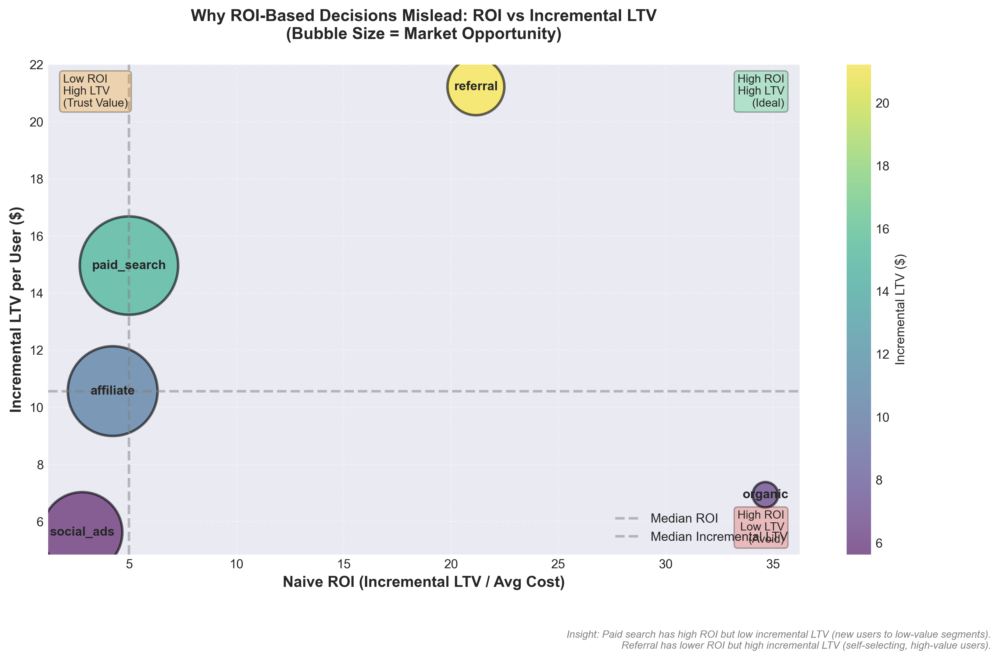
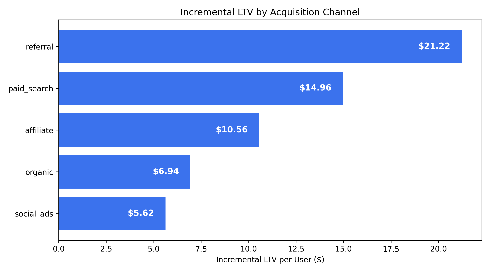
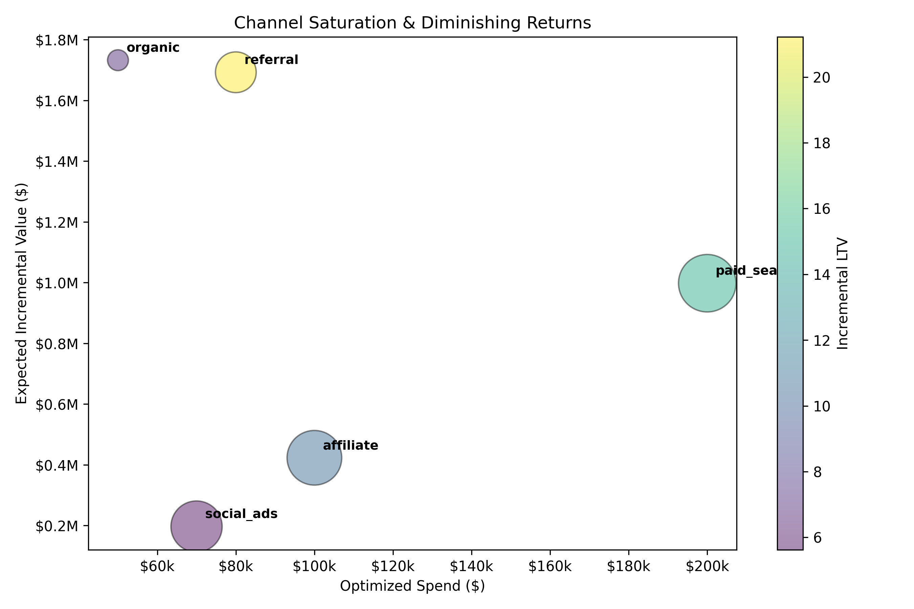
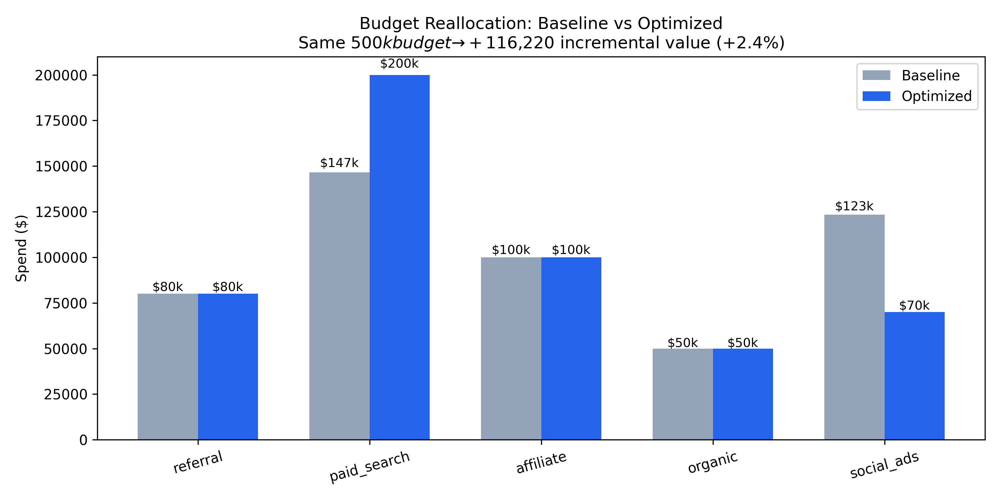

# Growth Allocation Engine: Identifying High-Value Acquisition Channels at Scale

## TL;DR

- I evaluated acquisition channels to understand which ones *causally* drive long-term value, not just short-term conversions.
- At first glance, ROI-based allocation looked reasonable, with organic and paid search appearing highly efficient.
- Deeper analysis revealed strong user-quality differences, channel saturation, and hidden churn risk.
- **Final decision:** Reallocate budget using incremental LTV–based optimization. Same budget, higher long-term value. Ship the optimized allocation.

---

## Product Context

The product is a consumer-facing short-form content platform where user engagement and retention directly drive monetization through ads and subscriptions.

As the product scaled, acquisition spend increased rapidly across multiple channels. While topline growth looked healthy, leadership needed a clearer answer to a harder question:

**Which acquisition channels actually bring in users who stay and create long-term value?**

The decision at stake was not whether to grow, but how to grow responsibly without over-investing in channels that inflate short-term metrics while degrading long-term product health.

---

## Users & Segmentation

I segmented users into three engagement-based cohorts using early post-acquisition behavior:

- **Low engagement users** – infrequent sessions, fast churn
- **Normal engagement users** – stable but moderate activity
- **Power users** – highly engaged, retention drivers

This segmentation mattered because acquisition channels source very different mixes of users. Any channel-level analysis that ignores this heterogeneity risks optimizing for the wrong audience.

---

## Metric Design

**North Star Metric**

- **Incremental Lifetime Value (LTV):** the additional long-term value *caused* by exposure to a channel.

**Secondary Metrics**

- Incremental value per dollar spent
- Channel saturation and diminishing returns

**Guardrails**

- Risk-adjusted profit
- Spend concentration limits
- Minimum channel diversification

These metrics were chosen deliberately. Optimizing conversion rate or ROI alone would bias spend toward channels that convert users who would have converted anyway, or users who churn quickly. Incremental LTV forces the analysis to focus on causal value creation.

---

## Data Snapshot

**Users (sample)**

| user_id | engagement_segment | signup_date | channel |
|--------|-------------------|-------------|---------|
| u_001  | low               | 2024-01-02  | social_ads |
| u_002  | normal            | 2024-01-03  | paid_search |
| u_003  | power             | 2024-01-04  | referral |
| u_004  | low               | 2024-01-05  | affiliate |
| u_005  | normal            | 2024-01-06  | organic |

Early inspection surfaced clear selection bias: referral users over-indexed on power users, while paid channels skewed toward lower engagement cohorts.

---

## The Standard Analysis (What Most Teams Would Do)

The baseline approach allocates budget using **ROI**:

> Expected value ÷ cost per user

Using this lens:
- Organic appears extremely efficient due to near-zero cost
- Paid search scales predictably with volume
- Social ads look viable due to conversion throughput

A proportional or ROI-weighted budget split looks defensible, especially at small scale. This is where many teams stop.

---

## Why That Analysis Was Misleading

The flaw is subtle but critical.

ROI assumes:
- All conversions are equally valuable
- Users would not have converted without the channel
- Marginal returns scale linearly with spend

None of these assumptions hold at scale. ROI collapses user quality, causality, and saturation into a single number, hiding the true tradeoffs.

### ROI vs Incremental LTV

This view makes the problem visible: channels with strong ROI often deliver weaker incremental lifetime value, while high-quality channels appear less efficient on surface metrics.

---

## My Approach (Correct Methodology)

I reframed the problem around causality and long-term value.

**Step 1: Causal uplift estimation**  
I estimated incremental conversion lift per channel using uplift modeling on propensity-balanced cohorts. This answered a sharper question: *which users converted because of the channel?*

**Step 2: LTV forecasting**  
I forecasted long-term value using a survival-based model (Cox Proportional Hazards), accounting for churn over a 24-month horizon and applying a 10% annual discount rate.

**Step 3: Incremental LTV calculation**  
I combined causality and value:  
**Incremental LTV = Conversion uplift × Expected LTV**

---

## Results (Corrected View)

### Incremental LTV by Channel

- Referral: **$21.22**
- Paid Search: **$14.96**
- Affiliate: **$10.56**
- Organic: **$6.94**
- Social Ads: **$5.62**

This ranking differs sharply from ROI-based rankings and immediately explains why some “efficient” channels underperform long term.

---

## Channel Saturation & Diminishing Returns

Incremental value does not scale linearly with spend. Paid search absorbs large budget but shows diminishing marginal returns, while referral remains highly efficient but reach-constrained. These dynamics justify explicit optimization constraints.

---

## Budget Optimization Outcome

Using a constrained optimization framework with a fixed $500k budget:

- **Baseline expected value:** $4.93M  
- **Optimized expected value:** $5.04M  
- **Incremental gain:** +$116k (+2.4%)

### Baseline vs Optimized Allocation

Same budget. Better allocation.

---

## Segment-Level Insights

- **Referral** consistently sourced power users with high retention and long lifetimes.
- **Paid search** delivered volume but skewed toward normal and low engagement users, driving saturation.
- **Social ads** disproportionately sourced low engagement users with elevated churn risk.

Without segment-level analysis, these risks would have remained hidden.

---

## Key Findings & Inference

1. Incremental LTV, not ROI, is the correct objective for growth decisions.
2. High-conversion channels can deliver low causal value.
3. Channel saturation dominates scaling decisions.
4. Low-quality growth quietly erodes long-term product health.
5. Optimization must respect constraints to avoid over-concentration risk.

---

## What Would Have Gone Wrong Without This Analysis

Without this analysis, the team would have:
- Continued scaling paid search past its efficient frontier
- Over-invested in social ads due to misleading ROI
- Underweighted referral despite its long-term impact

The failure would surface months later as weaker cohorts and declining lifetime value, making it difficult to attribute the root cause.

---

## Recommendation & Next Steps

**Decision:** Ship the optimized allocation.

**Next steps**
- Monitor saturation curves quarterly
- Re-estimate uplift as user mix evolves
- Add sensitivity analysis around churn assumptions
- Extend framework to multi-touch attribution

---

## Key Takeaway

**Growth should be optimized for causal lifetime value, not surface-level efficiency.**
